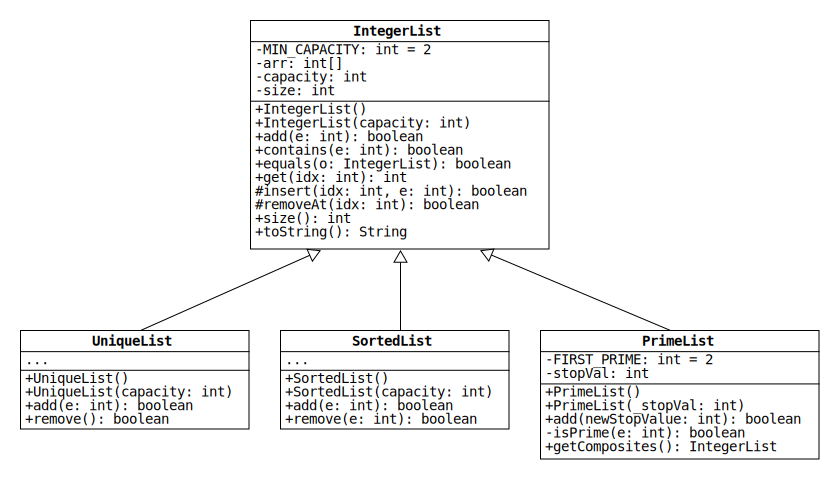

# Lab 5: Inheritance with Lists

In object-oriented programming, inheritance allows for an existing class to become specialized by extending it to subclasses. We refer to these subclasses as a derived or "child" class, and the existing class as the "parent".

In this lab, we are given a parent class **IntegerList** and we must write three specializations of it: **UniqueList**, **SortedList**, and **PrimeList**.

***Note:*** Please read the section on git and the command line before downloading the contents of your repo.
On this assignment, we want you to use the command line instead of GitHub's browser interface. 
After you become familiar with a few commands, you will see this is much more convenient.

## Class Diagram
Inheritance is represented by a connection between two classes, with a white arrow pointing to the parent.



Note that the methods insert and removeAt in **IntegerList** are preceded by the symbol "#". This indicates that the methods are protected.

## IntegerList Class

A basic resizable array of integers, very similar to the resizable arrays we programmed in the past, except this one has already been mostly written. For additional information on the class methods please see the documentation.

### Student Work
Note that the stubs for these methods are already at the bottom of IntegerList.java
* `contains(int)`: Checks if the specified integer is in the array. Returns true if element is found, else false.

* `equals(IntegerList)`: Returns true if the given IntegerList is equal to the IntegerList on which the method was called. 
Otherwise, the method returns false.
We will define "equal" in this context to mean that the contents of the arrays stored in the two IntegerLists are the same.
Note: Only check the integers at indices less than the sizes.

## UniqueList Class

This class will only allow each distinct element to appear once. Since this functionality is not already covered by **IntegerList**, we will have to write logic to prevent duplicates.

### Student Work
* `UniqueList()`: Construct an empty list

* `UniqueList(int)`: Construct a list with the specified capacity

* `add(int)`: Adds the specified integer to the list, assuming it does not already exist. The method returns false if the value already exists; otherwise, it returns true.

* `remove()`: Removes the last element from the list, assuming it exists.
The method returns false if the list is empty; otherwise, it returns true.

## SortedList Class

This class will require that the list stays sorted as new elements are added. Since this functionality is not already covered by **IntegerList**, we will have to write logic that guarantees it.

### Student Work
* `SortedList()`: Construct an empty list.

* `SortedList(int)`: Construct an empty list with the specified capacity.

* `add(int)`: Adds the specified integer to the list. Note that in order to keep the array sorted we will first need to find where each element goes. This method *should* always return true.

* `remove(int)`: Removes the specified integer from the list, ensuring that all other elements stay sorted.
The method returns false if the given integer is not in the last; otherwise, it returns true.

## PrimeList Class

This class will have behavior that is quite different from the parent class. Instead of having the user supply all elements of this list one-by-one, the user supplies a *stop value*. The contents of this list should be all [prime numbers](https://en.wikipedia.org/wiki/Prime_number) leading up to the given *stop value*.

### Student Work
* `PrimeList()`: Construct an empty list of integers with a *stop value* of 0.

* `PrimeList(int)`: Construct a list of integers containing all prime numbers leading up to the given *stop value*. Note that the stop value must be positive.

* `add(int)`: The argument for this method is different from the other derivations; instead of being an element to add, this argument is the *new stop value* for your prime list. If the argument is larger than the previous stopping value, the list should be updated to contain all primes up to the *new stop value*.

* `isPrime(int)`: Determines if an integer is a prime number.

* `getComposites()`: Returns an IntegerList containing all [composite numbers](https://en.wikipedia.org/wiki/Composite_number) between 2 (the lowest prime) and the *stop value*.

## Special Topic - git CLI

### Motivation
When we develop software in an academic setting, typically there is only one developer on a project (the author) and the project is only submitted once (for credit). Well, in the real world this is not the case; you can have three SE's working on the same file and submitting multiple changes every day. So how do we make sure that everyone has the correct version of the code, and that no one is overwriting each other? This question prompted the creation of version control systems (VCS), the most popular of which is called git.

### Terms
* git: a widely used version control system (VCS)
* GitHub: a website which allows for remote storage of git repositories
* CLI: Command Line Interface (i.e. commands that are used without a GUI)

### How do git
If you haven't done so already, install git on your computer. 
For Windows users, install [Git for Windows](https://gitforwindows.org/).
For macOS users, install the Xcode Command Line Tools. 
macOS will do this automatically if you open a terminal and run the following command: `git --version`.

#### Set name and email
To make commits with git, you first need to set your name and email address.
Open a terminal and run the following two commands:
```bash
git config --global user.name {name}
git config --global user.email {email address}
```
Make sure you replace `{name}` and `{email address}` with your actual name and email address.

#### Cloning
Navigate to the folder where you store your Eclipse projects.
To change folders in the terminal, use the command `cd {folder name}`.
To see a list of all the folders inside the current folder, use the command `ls`.

Once you're in the desired folder, retrieve your repository from the internet with the `clone` command:
``` bash
git clone https://github.com/{username}/{repository_name}
```
Instead of typing out the URL, you can copy it from GitHub by clicking the green "Code" button and then clicking the clipboard.
Paste the URL into the terminal by right-clicking the window and then selecting "Paste."

The clone command will create a new folder with the contents of your repo.
Feel free to change the name of this folder to something simpler like "Lab5".

#### Import into Eclipse
Once the repository has been cloned, import it into Eclipse with the "Open Projects from File System..." or "Import..." dialog, just like with past assignments.

#### Updating git index
To save your code changes, you must first add the source files to the git index (the index designates which files git is tracking).
This is done by running the `add` command in the root folder of your project:
```sh
git add src\IntegerList.java
```
You can add all changed files with the `-A` option:
```bash
git add -A
```

#### Committing code
After adding files to the git index, save the changes with the `commit` command.
Developers should always include a descriptive commit message with the `-m` option:
``` bash
git commit -m "Meaningful commit message here"
```

#### Updating remote
At this point, your local copy of the repository is updated, but your GitHub repo still has the old files.
To update your remote repository, use the `push` command. 
Note that push requires that you specify where it pushes to.
Thankfully, by cloning a repo from GitHub using `git clone`, git will automatically configure the local repository to push to the correct URL.
This destination is code-named "origin", and it can be used as the argument for push:
``` bash
git push origin
```
